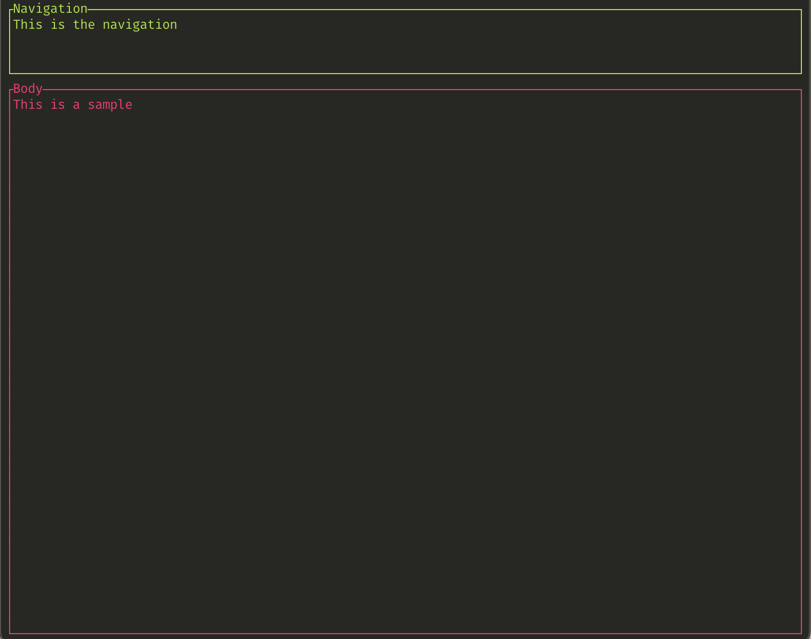
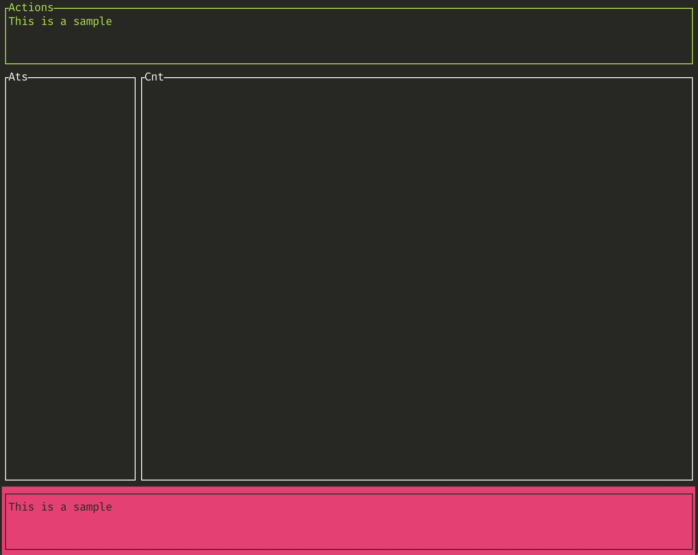

# tui-markup
Rust library to use TUI and markup to build UI terminal interfaces.

## Explanation
### How it works

As a developer is easier to create a known data structure describing the user interface.

Sample markup code:

```xml
<layout id="root" direction="vertical">
  <container id="nav_container" constraint="5">
    <p id="toolbar" title="Navigation" border="all" styles="fg:green">
      This is the navigation
    </p>
  </container>
  <container id="body_container" constraint="10min">
    <p id="body" title="Body" border="all" styles="fg:red">
      This is a sample
    </p>
  </container>
</layout>
```

generates:



### A more complex sample:

```xml
<layout id="root" direction="vertical">
  <container id="nav_container" constraint="5">
    <p id="toolbar" title="Actions" border="all" styles="fg:green">
      This is a sample
    </p>
  </container>
  <container id="body_container" constraint="10min">
    <block id="body_block" border="none">
      
      <layout id="content_info" direction="horizontal">
        <container id="ats_container" constraint="20%">
          <block id="ats_block" title="Ats" border="all">
      
          </block>
        </container>
        <container id="cnt_container" constraint="20min">
          <block id="cnt_block" title="Cnt" border="all">
            
          </block>
        </container>
      </layout>

    </block>
  </container>
  <container id="nav_container" constraint="5">
    <p id="footer" border="all" styles="bg:red;fg:black">
      This is a sample
    </p>
  </container>
</layout>
```

generates:



## Planned features

* Add events to widgets
* Runtime template change

